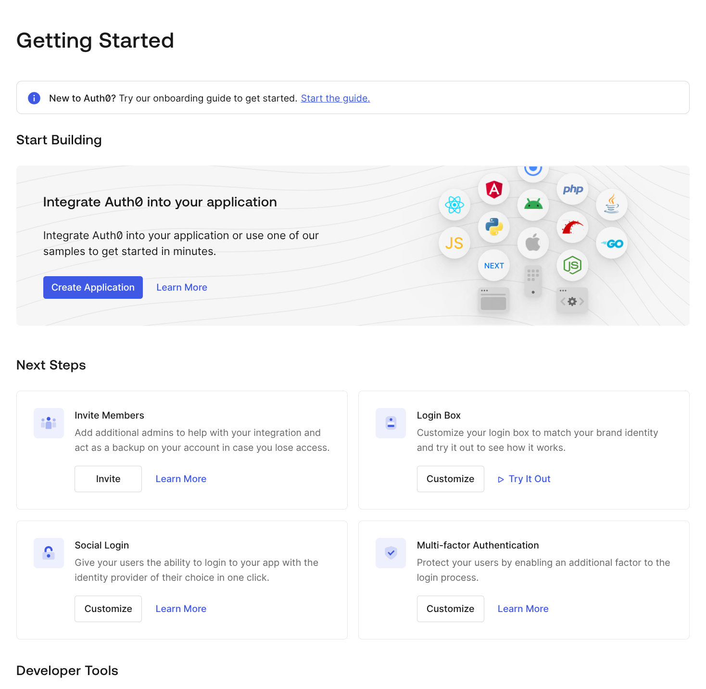
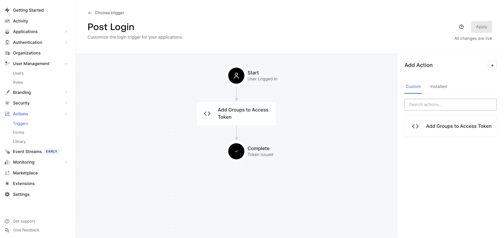

## Setting up Auth0 as OIDC provider

Auth0 offers a Free Plan for testing OIDC.

For use with an MCP scenario, I suggest this:

### Setup Steps

1. Signup and Sign-in to Auth0.

2. After you have signed in you should see the "Getting Started" page:
   

   If not, Visit [Manage](https://manage.auth0.com/)

3. In the Left-hand-side Navigation bar, select Applications.

4. Create an Application
   - Name: MCP-Client-App1 (or whatever seems appropriate)
   - Client ID and Secret are auto-populated
   - The Domain will be auto-populated too.
   - Take note of all three items, you will need these later.
   - scroll down, set OAuthV2 callback to http://localhost:7777/oauth/callback
   - set `ID Token Expiry` if you like. I chose 3600.
   - **Save**

5. In the Left-hand-side Navigation bar, select APIs

6. Create an API. This is a protected "thing".

   - Name: "MCP Products Service"
   - Identifier (=Audience): mcp-products-service1
   - (optional) set AccessToken expiry: 86400
   - **Save**


7. We need a "az_groups" claim in the Access Token.

  In your Auth0 Dashboard, navigate to Actions > Library.
   - Click the "Create Action" and select "Create Custom Action"
   - Specify a name, like "Add Groups to Access Token."
   - Select the trigger Login / Post Login.
   - Accept the default Node runtime
   - Click Create.
   - specify this code in the editor:
   ```js
   exports.onExecutePostLogin = async (event, api) => {
     const groups = Array.from(event.user.app_metadata.groups || []);
     console.log(`Found groups: [${groups.join(',')}]`);
     // Set a custom claim, with array value on the Access Token
     api.accessToken.setCustomClaim(`az_groups`, groups);

     // Optional: also set it on the ID Token
     api.idToken.setCustomClaim(`groups1`, groups);
    };
   ```

   This logic will apply the appropriate custom claim into the Access Token generated by Auth0.


8. Attach that Custom Action to the login event.

   - Navigate to Actions > Triggers in the sidebar.
   - select `post-login`
   - Drag-and-drop the "Add Groups to Access Token" action between the "Start" and Complete" icons
   

   - Click Apply.

9. Add a User, and set Groups on the user entity:

   - Navigate to User Management > Users
   - Create User
   - Supply an email and password
   - Click the User to modify settings
   - Scroll down to "App Metadata"
   - Supply this value:
     ```json
     {
       "groups": [ "staff", "prodmgmt", "users" ]
     }
     ```
   - **Save**


9. Modify your MCP Client settings appropriately.

   If you are using Gemini CLI, then modify `settings.json` to look like this:

   ```json
    "mcpServers": {
      "products": {
        "httpUrl": "https://your-apigee-hostname/mcp-access-control/mcp",
        "oauth": {
          "enabled": true,
          "audiences": ["mcp-products-service1"],
          "clientId": "client-id-from-Auth0",
          "clientSecret": "client-secret-from-auth0"
        }
      }
    },
   ```

8. In your terminal, set the `OIDC_SERVER` environment variable to
   `https:\\` plus the Domain from the Auth0 setup dashboard.

   It will look something like this: https://dev-b08ghq9d2n1am5pl.us.auth0.com/

   You will use this later when you deploy proxies to Apigee.
