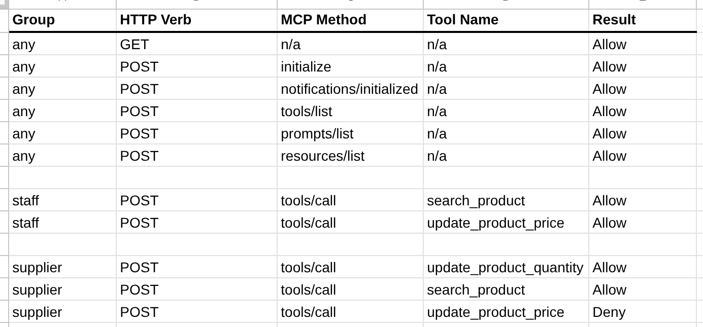

# Apigee Example - External Access Control for MCPs

This repository shows one way to wrap insecure MCP Servers
with an Apigee proxy that enforces externally-defined access
control decisions.

Many people think MCP is different enough that it requires a
different gateway, an entirely different approach in the network.

But it's not that different from what you already know.
- MCP uses JSONRPC, well known and in use since 2010
- MCP remote transport uses HTTP
- MCP security is built on OAuth

Sound familiar? If you have Apigee, you already have a platform that can
provide the right governance for this flavor of API.

## Access control options

It is possible to include _basic_ access control into Apigee, using the
Apigee configuation flow language. By "basic" I mean, it is possible for you to
configure an API Proxy to check whether the inbound request presents a token,
and whether the inbound token is valid for the given operation. But this is a
"client-oriented" authorization check - it does not consider the identity of the
attached user - and it is static.

But to include more dynamic access control into an Apigee API proxy, often you
will want to _externalize_ the access control decision, and allow Apigee to
enforce the decision. This externalized decision could rely on any arbitrary
data, including the identity of the user calling, ambient data, recent history
for that particular user, time of the day, and so on.

This repository shows one way to do that, using an implementation involving:
- An MCP Server, implemented in Python, running in Cloud run
- An API Proxy configured in Apigee X (cloud), that proxies to that server
- a _separate_ Cloud Run service, implemented in C#, that makes access control decisions
- an ExternalCallout policy in the Apigee proxy to call to the Access Control Cloud Run service

## Screencast

There's a [screencast](https://www.youtube.com/watch?v=18NJG7bD5EM) that shows
how all of this works.  I encourage you to check it out!

## Disclaimer

This example is not an official Google product, nor is it part of an
official Google product. It's just an example.


## Significant Assembly Required

This example relies on numerous moving parts and systems:
- an Open ID Connect Identity Provider
- An MCP Server implemented in Python with FastMCP, deployed to Cloud Run
- an Authorization Rules server, implemented inb C#/.NET, deployed to Cloud Run
- a spreadsheet that holds the rules for the above Authorization Server
- several API Proxies in Apigee

It's a big effort, bigger than I am able to commit to, at this time, for me to
share a repo with completely tested, working code and scripts that allows you to
reproduce all of this on your own.

But I'm publishing the code and configuration anyway, because I think
just reading and examining the moving parts will be helpful.

## Background

_Basic_ access control in Apigee, using the Apigee configuation flow language, is easy.  For
example, it's really easy to configure an Apigee API proxy to allow access, only if the caller
presents a valid token (using the built-in Apigee policy
[`OAuthV2`](https://cloud.google.com/apigee/docs/api-platform/reference/policies/oauthv2-policy),
with Operation = `VerifyAccessToken`).  Or a valid, unexpired API Key (using the built-in Apigee
policy
[`VerifyAPIKey`](https://cloud.google.com/apigee/docs/api-platform/reference/policies/verify-api-key-policy)).

In the simple case, the OAuthV2/VerifyAccessToken policy would look like this:
```xml
<OAuthV2 name="OAuthV2-Verify-Access-Token">
  <Operation>VerifyAccessToken</Operation>
</OAuthV2>
```

And the VerifyAPIKey policy would look like this:
```xml
<VerifyAPIKey name="APIKeyVerifier">
  <APIKey ref="request.queryparam.apikey" />
</VerifyAPIKey>
```

In the former case, the one relying on the OAuthV2 access token, of course, the calling app must
have previously obtained the access token, via some grant flow. That is just the standard
OAuthV2 model, nothing new there.

But as you can see, whether using a key or a token, the control is
binary. Either the caller has the valid key or token which is valid for the
current call, or it does not.  If you want finer-grained control, particularly
with MCP servers and tools, you want more control and flexibility than this
coarse-grained check can provide.

### The use of API Products for Access Control

To extend  beyond basdic checks, Apigee has the API product concept.
API publishers can configure specific client credentials (client IDs or API keys)
to be authorized for specific API Products.  The Products are really just collections of
API Proxies, with metadata. Each inbound request presents a credential, which
will resolve to a valid API Product.
Then, at runtime, Apigee will verify that the presented application client credential is
authorized for an API Product that includes the particular verb + path pair that the
current API request is using.

For a 15-minute screencast review of the API Product concept and the implicit verb+path
authorization checks, [see here](https://youtu.be/HGkW3gtk7OM). But the basics are:

- At configuration time:
  - API publishers define API Products. Each one includes 1 or more verb + path pairs.
  - Client developers obtain credentials (client IDs) for their apps. Each credential is authorized for one or more API Products.
  - Client developers embed those credentials into the apps they build.

- At runtime:
  - The client app sends in GET /foo (verb = GET, path = /foo).
  - When you call VerifyAPIKey or VerifyAccessToken, Apigee checks the key or token.
  - If valid, Apigee _implicitly_ checks that the verb + path pair is authorized via at least one of the API Products associated to the credential.

And beyond the basics, you can also configure Apigee to check a scope on an Access Token.

There is a handy
[working sample](https://github.com/GoogleCloudPlatform/apigee-samples/tree/main/apiproduct-operations)
that walks you through this, actually working in Apigee. Check it out!

### What about more flexible controls?

One thing that is missing here is "role based access control", a/k/a RBAC,
which would allow an access control decision based on the _identity of the human_
operating the application. Also missing is ABAC, what [OWASP calls "Attribute Based
Access
Control"](https://cheatsheetseries.owasp.org/cheatsheets/Authorization_Cheat_Sheet.html#prefer-attribute-and-relationship-based-access-control-over-rbac),
which allows control based not just on the role or identity of the caller, but also
based on additional data, such as: Job role, time of day, project name, originating IP address,
record creation date, prior activity pattern, and others. Apigee does not have a good
mechanism, by itself, for performing either user-by-user RBAC or the more general ABAC.

To accomplish user-based RBAC, or the more general ABAC, the typical pattern is to _externalize_
the access control decision and use Apigee to _enforce_ the decision. You would use this
_as a complement to_ the basic authorization checks Apigee can do with API Products.

The way it works for handling an inbound call (whether MCP or some other variant):

- The Apigee runtime collects or determines all of the information it needs to inform an
  access control decision. This might be information about the requesting user, a
  billing account status, patterns of recent activity, and so on. Normally the user
  information is obtained from something like an ID Token that is signed by an
  independent Identity Provider.

- Apigee sends an access control request to an external Access Control system. This
  request must include all the metadata that the external system will need to make a
  decision. The identity of the caller, the resource being requested, the specific
  action being requested, the source IP address, and so on. Whatever is required.

- The external system makes the decision (Allow or Deny), and sends it back to Apigee.

- The Apigee API proxy then enforces that decision.

The example contained in this repository shows how you can implement this pattern using
a custom Cloud Run service to externalize the access control decision for MCP Servers.

## Implementation Details

The example here shows the basic idea.
Here's how it works.

 1. A client app (eg Agent) sends an MCP call request into an Apigee API proxy. This call
    must include an Access Token in the Authorization header.

 2. The Apigee API proxy verifies the access token, checking that it is
    valid for the given proxy.

 3. If that passes, the Apigee API proxy calls to an external service, passing
    it {jwt payload, MCP method, MCP tool}. This service happens to be
    implemented in C#, but that's just a detail.

 4. The access control service calls the Google Sheets REST API to retrieve rules and roles.
    (This is cached)

 5. The access control service applies the access rules and returns a "ALLOW" or
    "DENY" to the proxy.

 6. The proxy enforces that decision, and proxies to the upstream MCP Server for ALLOW,
    otherwise issues a 403 status.


The rules look like this:


And the logic that evaluates whether a request should be authorized, extracts
the user identity from the access token, resolves that to a group/role, and then
matches the MCP verb and tool. If there is an ALLOW entry, the request is
allowed. Otherwise, not.


Some implementation notes:

1. In step 1, the access token that the agent sends, is obtained via a
   OAuthV2 authorization code grant type, from the OpenID Connect server
   registered for the particular MCP Server. You need to supply your own
   OIDC Server for this.  You can use [Auth0.com](https://auth0.com/) for this.
   For instructions, see [Auth0 setup](./Auth0-setup.md).

2. The API Proxy assumes that the JWKS endpoint is available at
   `${OIDC_SERVER}/jwks` and the token issuer is the same as the `${OIDC_SERVER}` url.

3. The access control service is a GRPC service. That means it will be relatively fast
   and efficient to call into, from your Apigee API Proxy, and it should be acceptable
   to incur that check for every API request. If the relatively low latency is still not
   acceptable, you can move the rules evaluation logic into the Apigee proxy itself.

### Why not use OPA for Access Control?

_Good Question!!_ [Open Policy Agent](https://www.openpolicyagent.org/) is a good
solution for storing, managing, and evaluating access rules, for arbitrary systems or
resources.  It's open source, well maintanied, and available as a deployable container
image. You can deploy [the container
image](https://hub.docker.com/r/openpolicyagent/opa) right to something like Cloud Run;
no need to build the code.

All sounds good, right?  The _one drawback_ that I've seen is that OPA depends on
[REGO](https://www.openpolicyagent.org/docs/policy-language) to express policies. This is
a domain-specific language; I have not seen it used in any place _other_ than OPA.
And it is somewhat novel. That can be an obstacle to some teams.

For this particular example, I decided to use a Google Sheet to store the access rules for these reasons:

- it's visual - it's easy to see what specific rules are in place, and easy to demonstrate;
- it's easy to update and maintain the access rules.
- it's easy to _protect_ the access rules with User rights on the Sheets document.
- it's easy to get a log of who changed what - just look at the version history on the sheet.

All of that, you get "for free" with a Google Sheet.

The C# logic that retrieves and applies the rules is also fairly easy to understand. The
combination of all of those factors means using Sheets and C# makes for a solution that
is more broadly _accessible_ than one based on the combination of OPA and REGO.

BUT, the architectural model of the solution using OPA would be _exactly the same_ as what I've
got here with a custom C# service and a Google Sheet.

## Deploying it for your own purposes

To follow the instructions to deploy this in your own environment, you will need the
following pre-requisites:

- Apigee X or hybrid
- a Google Cloud project with Cloud Run and Cloud Build enabled
- a Google Workspace environment that allows you to create and share spreadsheets
- .NET 8.0 - _if you want to modify the source code and build locally_. Otherwise Cloud Build will build it for you remotely, and you don't need .NET on your workstation.
- various tools: bash, [curl](https://curl.se/), [gcloud CLI](https://cloud.google.com/sdk/docs/install), [apigeecli](https://github.com/apigee/apigeecli), [jq](https://jqlang.org/)

You can get all of these things in the [Google Cloud Shell](https://cloud.google.com/shell/docs/launching-cloud-shell).


### Steps to follow

These will require some customization by you.  This is not fully tested and vetted.

0. Modify the [env.sh](./env.sh) file to suit your environment. Then source it to set those
   variables for use in subsequent commands:

   ```sh
   source ./env.sh
   ```

1. Enable the services needed:
   ```sh
   ./1-enable-services.sh
   ```

2. Signin with gcloud to allow the script to create a spreadsheet:
   ```sh
   ./2-auth-login.sh
   ```

3. Deploy the "Products" MCP Server to cloud run
   ```
   3-deploy-products-mcp-to-cloud-run.sh
   ```

3. Create the sheet that holds Rules + Roles.
   ```sh
   ./4-create-sheet.sh
   ```

   When the script finishes, define the shell variable for the Sheet ID. Find that from the output
   of the "create sheet" step.
   ```sh
   export SHEET_ID=VALUE-FROM-PRIOR-STEP
   ```

5. Create the service account for the Access Control service.
   ```sh
   ./5-create-service-account-for-access-control-service.sh
   ```

5. Manually share the sheet created previously with the SA email address.


6. Deploy the Cloud Run Service that will read and apply the Rules in the sheet.

   ```sh
   ./6-deploy-access-control-service-to-cloud-run.sh
   ```

   This takes a few minutes. It sends the source code up to Cloud Build,
   builds the service, then deploys it from the image.

7. Create the Apigee Target Server.

   This is the server entity pointing to the access control server.

   ```sh
   ./7-create-apigee-target-server-for-authz.sh
   ```

8. Install apigeecli

   ```sh
   ./8-install-apigeecli.sh
   ```

9. Import and deploy the Apigee API Proxies

   There is one to handle the MCP "Well known endpoints" (basepath `/.well-known/) and another
   to handle the other MCP transactions.

   ```sh
   ./9-import-and-deploy-apigee-proxies.sh
   ```

10. Configure an MCP Server in the chatbot or agent of
   your choice (Gemini CLI works),  like this:

   ```json
   "mcpServers": {
     "products": {
       "httpUrl": "https://your-apigee-endpoint/mcp-access-control/mcp",
       "oauth": {
         "enabled": true,
         "clientId": "ab4aded9d20f44RHgmrNCq",
         "clientSecret": "26a86ab545704312b748e331f854"
       }
     }
   }
   ```

   The clientId and clientSecret need to be known by your OIDC Server.
   Or, you can omit them if your server supports Dynamic Client Registration (DCR).

11. Start the agent; it should kickoff the OAuth flow and eventually
   invoke the MCP Server. You can open a Trace session on Apigee to see the interactions.


### Clean Up

1. Remove the Apigee assets.

   This includes the target server and the API proxy.

   ```sh
   ./99a-clean-apigee-entities.sh
   ```

2. Remove the Cloud Run assets.

   This includes the service account.

   ```sh
   ./99b-clean-cloud-run-authorization-service.sh
   ```

3. Manually delete the Google sheet.


## Support

This callout and example proxy is open-source software, and is not a supported part of
Apigee.  If you have questions or need assistance with it, you can try inquiring on [the
Google Cloud Community forum dedicated to Apigee](https://goo.gle/apigee-community)
There is no service-level guarantee for responses to inquiries posted to that site.

## License

This material is [Copyright © 2025 Google LLC](./NOTICE).
and is licensed under the [Apache 2.0 License](LICENSE). This includes the Java
code as well as the API Proxy configuration.

## Bugs

* The Cloud Run service is deployed to allow "unauthenticated access".  If you use
  something like this in a real system, you will want to deploy the Cloud Run service to
  allow run.invoke from the service account your Access Control Service runs as.

* The API Proxy does not perform "VerifyAPIKey" on the client ID contained
  within the Access Token. This is a simple extension. It requires synchronizing
  the Apps in Apigee with the Client ID in the OIDC Server.

* The C# service does not check for malformed rules or roles.
